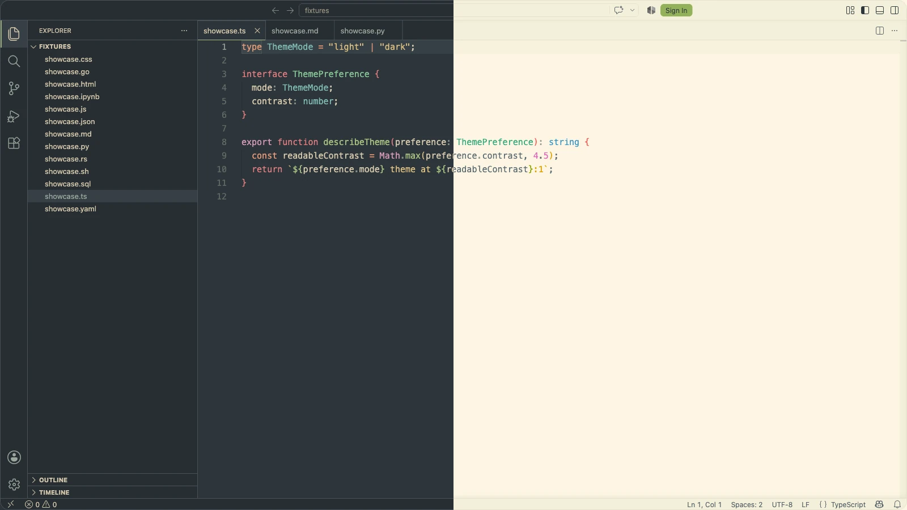
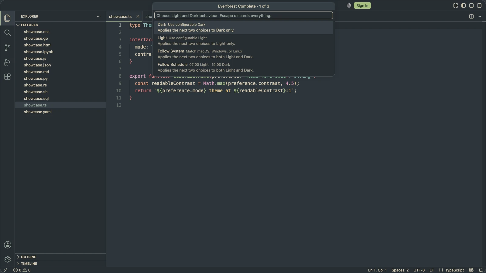
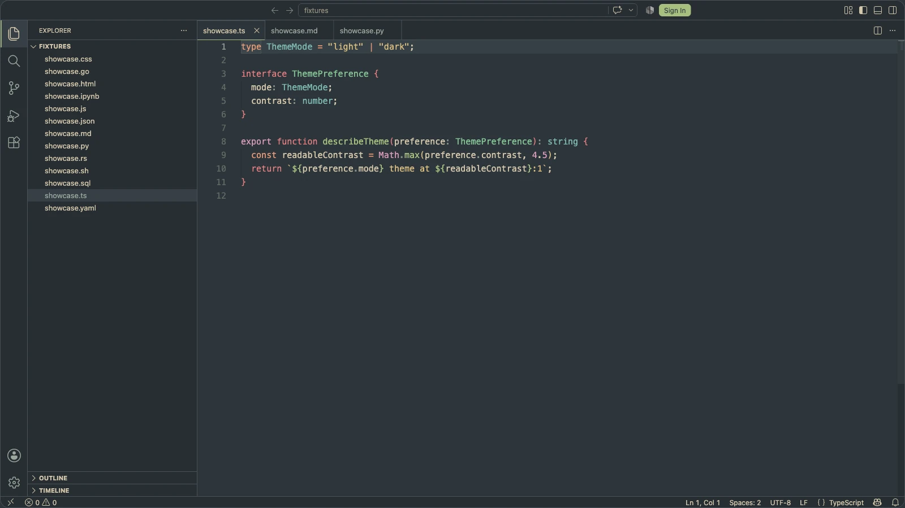

# Everforest Complete

[](https://github.com/overengineered-org/everforest-vscode-theme/actions/workflows/ci.yml)
[](https://github.com/overengineered-org/everforest-vscode-theme/actions/workflows/ci.yml)
[](https://github.com/overengineered-org/everforest-vscode-theme/actions/workflows/ci.yml)
[](https://marketplace.visualstudio.com/items?itemName=overengineered-org.everforest-complete)
[](./package.json)

**Requires VS Code 1.95.0 or later.**

Everforest Light and Dark with Soft, Medium, and Hard contrast, plus premium customization, free.



Private by design:

- No telemetry.
- No network requests.
- No workspace or source-code access.
- Settings regenerate the two configurable theme files only.
- Existing Soft, Medium, and Hard theme selections remain valid.

## Start here

**[Install Everforest Complete from the Visual Studio Marketplace](https://marketplace.visualstudio.com/items?itemName=overengineered-org.everforest-complete).**

Time: 2 minutes.

1. Open the extension published by **Overengineered**.
2. Select **Install**.
3. Select **Set Color Theme**.
4. Complete the three-step **Settle into Everforest Complete** walkthrough.

Done: Everforest now covers the complete interface and matches the way you work.

## Use all 14 premium controls

Time: 2 minutes.

1. Open the Command Palette: `⌘⇧P` on macOS or `Ctrl+Shift+P` on Windows/Linux.
2. Run **Everforest Complete: Configure Theme**.
3. Choose Appearance, Contrast, then Workbench.
4. Select **Reload Window** once when prompted.

Escape at any choice discards everything. Fixed Soft, Medium, and Hard presets never change.

| Native command                                          | Controls                                         |
| ------------------------------------------------------- | ------------------------------------------------ |
| **Everforest Complete: Configure Theme**                | Appearance, Light/Dark contrast, workbench style |
| **Everforest Complete: Configure Advanced Controls**    | Cursor, selection, italics, diagnostics, borders |
| **Everforest Complete: Configure Automatic Light/Dark** | Off, operating system, or exact local schedule   |

Advanced changes remain staged until **Apply Changes**. You never need to edit `settings.json`.
Controls apply across VS Code, never per workspace. Configuration requires VS Code Desktop.



## Automatic Light/Dark

1. Run **Everforest Complete: Configure Automatic Light/Dark**.
2. Choose **Off**, **Follow System**, or **Follow Schedule**.
3. For a schedule, enter the Light and Dark start times.

Times use your computer's local 24-hour clock. The extension sleeps until the next configured
boundary; it does not poll every minute. The command prevents system and scheduled switching from
competing.

## Desktop, remote, and web

- Desktop: every premium setting and scheduled switching works.
- SSH, Dev Containers, WSL, and desktop Codespaces: install the extension locally when prompted.
- Browser-hosted VS Code: all committed themes work; regeneration and scheduling require Desktop.

## Other installation paths

### GitHub Releases

1. Download `everforest-complete-X.Y.Z.vsix` from the
   [latest GitHub Release](https://github.com/overengineered-org/everforest-vscode-theme/releases/latest).
2. Open VS Code Desktop → **Extensions** → **Views and More Actions…** (`…`).
3. Select **Install from VSIX…**.
4. Choose the downloaded file.

### Build locally

Prerequisites: Node.js 24 and npm.

```sh
git clone https://github.com/overengineered-org/everforest-vscode-theme.git
cd everforest-vscode-theme
npm ci
npm run package:vsix
```

This creates `dist/everforest-complete.vsix`.

### Terminal

```sh
code --install-extension overengineered-org.everforest-complete
```

Use `code-insiders` for VS Code Insiders. For a downloaded release, replace the extension identifier
with the VSIX path.

## Verify a release download

Each GitHub Release includes a `.sha256` file.

```sh
# macOS
shasum -a 256 -c everforest-complete-X.Y.Z.vsix.sha256

# Linux
sha256sum -c everforest-complete-X.Y.Z.vsix.sha256

# Windows PowerShell
Get-FileHash everforest-complete-X.Y.Z.vsix -Algorithm SHA256
```

Marketplace installations receive updates through VS Code. Manually installed VSIX files require
another download.

## Coverage



- All 910 documented VS Code workbench colors, plus 27 extension-specific colors: 937 total.
- TextMate and semantic tokens for common programming and markup languages.
- Terminal, Git, diffs, diagnostics, tests, notebooks, minimap, and chat.
- GitLens, Error Lens, and GitHub Pull Requests and Issues colors.

## Contributing

```sh
npm ci
npm run verify:static
npm run test:integration
npm run package:verify
```

Edit `src/`, then run `npm run generate`. Do not hand-edit `themes/*.json`.

See [Contributing](CONTRIBUTING.md), [Architecture](docs/ARCHITECTURE.md), and
[Visual testing](docs/VISUAL_TESTING.md). Product decisions live in [PRODUCT.md](PRODUCT.md); visual
rules live in [DESIGN.md](DESIGN.md).

## Release model

- `fix:` → patch.
- `feat:` → minor.
- `feat!:` or `BREAKING CHANGE` → major.
- Documentation and chore-only changes → no release.

CI builds one validated VSIX. GitHub Releases receive those exact bytes and their SHA-256 checksum.
Marketplace publishing verifies the release asset, then uses the protected `VSCE_PAT` secret.

## Credits

Everforest Complete derives its palette and substantial mappings from
[Everforest](https://github.com/sainnhe/everforest) and
[Everforest for Visual Studio Code](https://github.com/sainnhe/everforest-vscode) by sainnhe.

See [NOTICE](NOTICE) and [LICENSE](LICENSE).
