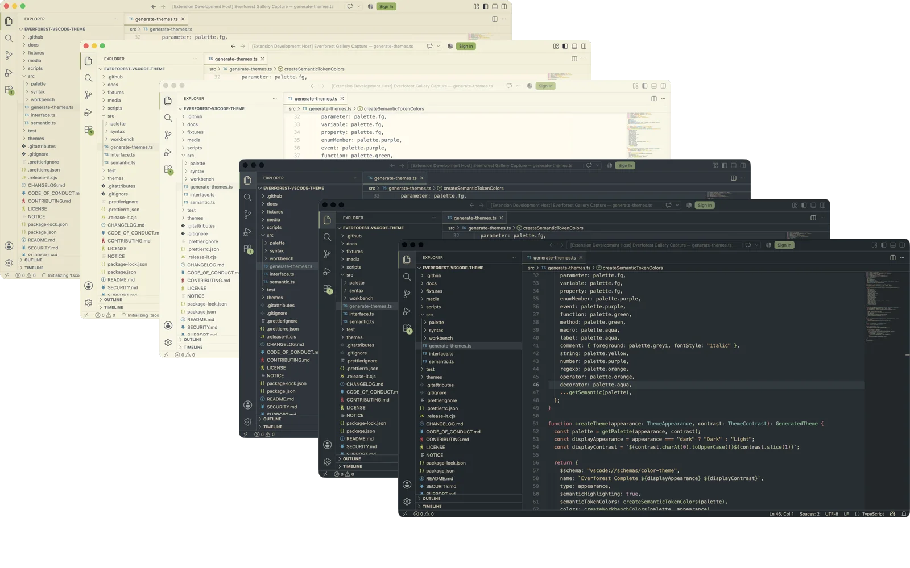

# Everforest Complete

[](https://github.com/overengineered-org/everforest-vscode-theme/actions/workflows/ci.yml)
[](https://github.com/overengineered-org/everforest-vscode-theme/actions/workflows/ci.yml)
[](https://github.com/overengineered-org/everforest-vscode-theme/actions/workflows/ci.yml)
[](https://marketplace.visualstudio.com/items?itemName=overengineered-org.everforest-complete)
[](./package.json)

**Requires VS Code 1.95.0 or later.**

Everforest Light and Dark with Soft, Medium, and Hard contrast—plus premium customization, free.



Private by design:

- No telemetry.
- No network requests.
- No workspace or source-code access.
- Settings regenerate the two configurable theme files only.
- Existing Soft, Medium, and Hard theme selections remain valid.

## Start here

**[Install Everforest Complete from the Visual Studio Marketplace](https://marketplace.visualstudio.com/items?itemName=overengineered-org.everforest-complete).**

Time: 2 minutes.

1. Open the extension published by **Overengineered**.
2. Select **Install**.
3. Select **Set Color Theme**.
4. Choose a theme:
   - **Everforest Complete Dark** or **Light** for premium customization.
   - A named **Soft**, **Medium**, or **Hard** preset for fixed settings.

Done: the complete VS Code interface now uses Everforest.

## Use all 14 premium controls

Time: 1 minute.

1. Choose **Everforest Complete Dark** or **Everforest Complete Light** as your color theme.
2. Open the Command Palette: `⌘⇧P` on macOS or `Ctrl+Shift+P` on Windows/Linux.
3. Run **Everforest Complete: Open Premium Settings**.
4. Change any control below.
5. Select **Reload Window** when prompted.

Done: your configurable Light and Dark themes now use the new settings. Fixed Soft, Medium, and Hard
presets never change.

| Controls                      | Settings                                                                                  | Options                                |
| ----------------------------- | ----------------------------------------------------------------------------------------- | -------------------------------------- |
| 1–2. Dark/Light contrast      | `everforestComplete.darkContrast`<br>`everforestComplete.lightContrast`                   | Soft, Medium, Hard                     |
| 3–4. Dark/Light workbench     | `everforestComplete.darkWorkbench`<br>`everforestComplete.lightWorkbench`                 | Material, Flat, High Contrast          |
| 5–6. Dark/Light cursor        | `everforestComplete.darkCursor`<br>`everforestComplete.lightCursor`                       | Black/white or an Everforest accent    |
| 7–8. Dark/Light selection     | `everforestComplete.darkSelection`<br>`everforestComplete.lightSelection`                 | Grey or an Everforest accent           |
| 9–10. Keyword/comment italics | `everforestComplete.italicKeywords`<br>`everforestComplete.italicComments`                | On or off                              |
| 11–12. Diagnostics/borders    | `everforestComplete.diagnosticTextBackgroundOpacity`<br>`everforestComplete.highContrast` | 0–50% opacity; stronger borders on/off |
| 13–14. Scheduled switching    | `everforestComplete.autoSwitch.enabled`<br>`everforestComplete.autoSwitch.schedule`       | On/off; local `HH:MM` theme entries    |

Premium settings apply across VS Code, never per workspace. Scheduled switching requires VS Code
Desktop.

Example:

```json
{
  "everforestComplete.darkContrast": "hard",
  "everforestComplete.lightContrast": "soft",
  "everforestComplete.darkWorkbench": "material",
  "everforestComplete.lightWorkbench": "flat",
  "everforestComplete.darkCursor": "aqua",
  "everforestComplete.lightCursor": "blue",
  "everforestComplete.darkSelection": "green",
  "everforestComplete.lightSelection": "aqua",
  "everforestComplete.italicKeywords": false,
  "everforestComplete.italicComments": true,
  "everforestComplete.diagnosticTextBackgroundOpacity": "12.5%",
  "everforestComplete.highContrast": false
}
```

## Automatic Light/Dark

Choose one switching method. Do not enable both.

### Follow your operating system

1. Open VS Code Settings.
2. Enable **Window: Auto Detect Color Scheme**.
3. Set **Preferred Dark Color Theme** to **Everforest Complete Dark**.
4. Set **Preferred Light Color Theme** to **Everforest Complete Light**.

Equivalent JSON:

```json
{
  "window.autoDetectColorScheme": true,
  "workbench.preferredDarkColorTheme": "Everforest Complete Dark",
  "workbench.preferredLightColorTheme": "Everforest Complete Light"
}
```

### Follow a schedule

Disable **Window: Auto Detect Color Scheme**, then add:

```json
{
  "everforestComplete.autoSwitch.enabled": true,
  "everforestComplete.autoSwitch.schedule": [
    { "time": "07:00", "theme": "Everforest Complete Light" },
    { "time": "19:00", "theme": "Everforest Complete Dark" }
  ]
}
```

Times use your computer's local 24-hour clock. The extension sleeps until the next configured
boundary; it does not poll every minute.

## Desktop, remote, and web

- Desktop: every premium setting and scheduled switching works.
- SSH, Dev Containers, WSL, and desktop Codespaces: install the extension locally when prompted.
- Browser-hosted VS Code: all committed themes work; regeneration and scheduling require Desktop.

## Other installation paths

### GitHub Releases

1. Download `everforest-complete-X.Y.Z.vsix` from the
   [latest GitHub Release](https://github.com/overengineered-org/everforest-vscode-theme/releases/latest).
2. Open VS Code Desktop → **Extensions** → **Views and More Actions…** (`…`).
3. Select **Install from VSIX…**.
4. Choose the downloaded file.

### Build locally

Prerequisites: Node.js 24 and npm.

```sh
git clone https://github.com/overengineered-org/everforest-vscode-theme.git
cd everforest-vscode-theme
npm ci
npm run package:vsix
```

This creates `dist/everforest-complete.vsix`.

### Terminal

```sh
code --install-extension overengineered-org.everforest-complete
```

Use `code-insiders` for VS Code Insiders. For a downloaded release, replace the extension identifier
with the VSIX path.

## Verify a release download

Each GitHub Release includes a `.sha256` file.

```sh
# macOS
shasum -a 256 -c everforest-complete-X.Y.Z.vsix.sha256

# Linux
sha256sum -c everforest-complete-X.Y.Z.vsix.sha256

# Windows PowerShell
Get-FileHash everforest-complete-X.Y.Z.vsix -Algorithm SHA256
```

Marketplace installations receive updates through VS Code. Manually installed VSIX files require
another download.

## Coverage

- Every documented VS Code workbench color: 937/937.
- TextMate and semantic tokens for common programming and markup languages.
- Terminal, Git, diffs, diagnostics, tests, notebooks, minimap, and chat.
- GitLens, Error Lens, and GitHub Pull Requests and Issues colors.

## Contributing

```sh
npm ci
npm run verify:static
npm run test:integration
npm run package:verify
```

Edit `src/`, then run `npm run generate`. Do not hand-edit `themes/*.json`.

See [Contributing](CONTRIBUTING.md), [Architecture](docs/ARCHITECTURE.md), and
[Visual testing](docs/VISUAL_TESTING.md). Product decisions live in [PRODUCT.md](PRODUCT.md); visual
rules live in [DESIGN.md](DESIGN.md).

## Release model

- `fix:` → patch.
- `feat:` → minor.
- `feat!:` or `BREAKING CHANGE` → major.
- Documentation and chore-only changes → no release.

CI builds one validated VSIX. GitHub Releases receive those exact bytes and their SHA-256 checksum.
Marketplace publishing verifies the release asset, then uses the protected `VSCE_PAT` secret.

## Credits

Everforest Complete derives its palette and substantial mappings from
[Everforest](https://github.com/sainnhe/everforest) and
[Everforest for Visual Studio Code](https://github.com/sainnhe/everforest-vscode) by sainnhe.

See [NOTICE](NOTICE) and [LICENSE](LICENSE).
