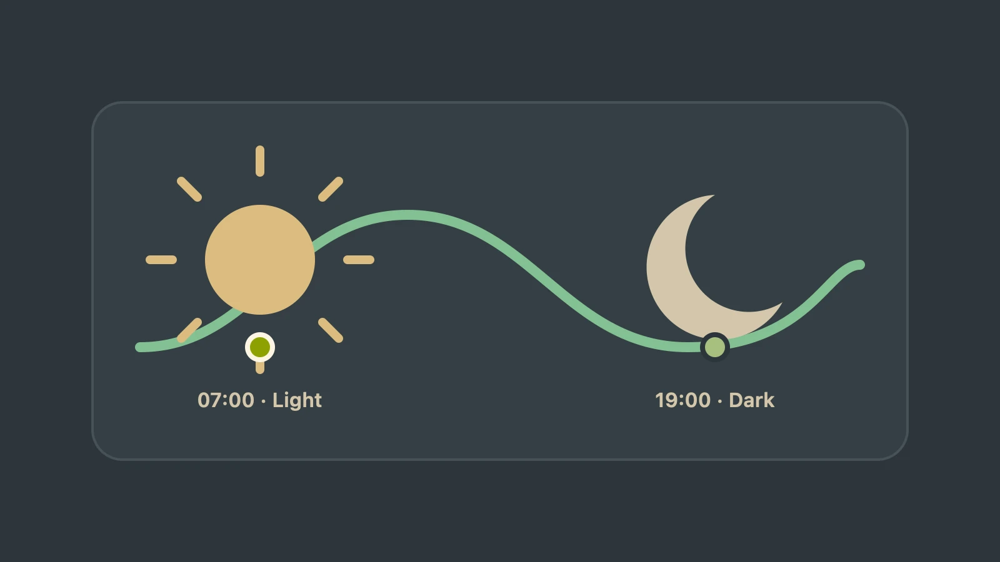

# Everforest Complete

[](https://marketplace.visualstudio.com/items?itemName=overengineered-org.everforest-complete)
[](./package.json)

**Requires VS Code 1.95.0 or later.**

Eight (8) themes: six fixed presets (Dark and Light in Soft, Medium, and Hard contrast) plus two
configurable themes (**Everforest Complete Dark** and **Everforest Complete Light**). All controls
are free and local.

Theme picker labels:

- Fixed: `Everforest Complete Dark Soft`, `Everforest Complete Dark Medium`,
  `Everforest Complete Dark Hard`, `Everforest Complete Light Soft`,
  `Everforest Complete Light Medium`, and `Everforest Complete Light Hard`.
- Configurable: `Everforest Complete Dark` and `Everforest Complete Light`.


## Privacy

- No telemetry or network requests.
- No workspace or repository file contents and no source code are read.
- Everforest may inspect VS Code workspace/folder configuration values—not workspace files or source
  code—to guard its global-only writes.
- Everforest reads VS Code configuration and its own installed theme files; it writes global values
  for its extension settings and coordinated `window`/`workbench` theme settings, plus its own two
  generated configurable theme files.
- Theme regeneration can briefly create extension-owned lock, journal, temporary, backup, and
  restore siblings beside those two files. They are transaction artifacts, not workspace files;
  successful runs clean them up, while an interrupted recovery may retain them for the next repair.
- The six fixed preset files are never changed by configuration.

## Start here

### VS Code Desktop

1. [Install Everforest Complete from the Visual Studio Marketplace](https://marketplace.visualstudio.com/items?itemName=overengineered-org.everforest-complete).
2. Open **Color Theme** and choose a fixed preset or configurable Light/Dark theme.
3. Complete the three-step **Settle into Everforest Complete** walkthrough.

The walkthrough takes under two minutes. VS Code Desktop supports configurable-theme regeneration
and automatic switching; the walkthrough is Desktop-only.

### Browser-hosted VS Code

1. Install Everforest Complete when your browser-hosted VS Code provides Marketplace extensions.
2. Open **Color Theme** and choose one of the eight committed themes.
3. If you run a configuration command, the browser fallback explains the Desktop requirement and
   offers **Choose Fixed Theme** to open the native theme picker.

The six fixed presets and the committed configurable Light/Dark defaults work in the browser. The
browser fallback does not regenerate theme files or run automatic scheduling; use VS Code Desktop
for those controls. It does not show the Desktop walkthrough.

SSH, Dev Containers, WSL, and desktop Codespaces use the Desktop path. Install the extension in the
local UI host when VS Code prompts you.

## Configure all 14 settings/controls

Open the Command Palette and run **Everforest Complete: Configure Theme** for Appearance, Contrast,
and Workbench. Run **Everforest Complete: Configure Advanced Controls** for editor and accessibility
detail. Run **Everforest Complete: Configure Automatic Light/Dark** for system appearance or a local
schedule. Run **Everforest Complete: Regenerate Themes** only when you need to rebuild the two
configurable theme files after an external change.

Guided setup commits after its third choice. Advanced Controls stage changes until Apply; Escape
discards them. Both flows run one configurable-theme regeneration check and offer at most one reload
when those files change. Automatic Light/Dark is separate: its command applies switching mode,
schedule, and coordinated native appearance settings without regenerating theme files or offering a
reload prompt.

Every extension setting is application-scoped (global), so settings apply across VS Code windows and
cannot be set per workspace. Everforest does not create or edit workspace or folder files. Automatic
Light/Dark also coordinates VS Code's global `window.autoDetectColorScheme` and `workbench` theme
settings; a workspace or folder override of those native settings must be removed before the command
can apply its global choice. The commands are the supported setup path; manual `settings.json`
editing is not required.

| Group             | Settings                                                                                                                                                                                                             |
| ----------------- | -------------------------------------------------------------------------------------------------------------------------------------------------------------------------------------------------------------------- |
| Appearance (4)    | `everforestComplete.darkContrast`, `everforestComplete.lightContrast`, `everforestComplete.darkWorkbench`, `everforestComplete.lightWorkbench`                                                                       |
| Editor (6)        | `everforestComplete.darkCursor`, `everforestComplete.lightCursor`, `everforestComplete.darkSelection`, `everforestComplete.lightSelection`, `everforestComplete.italicKeywords`, `everforestComplete.italicComments` |
| Accessibility (2) | `everforestComplete.diagnosticTextBackgroundOpacity`, `everforestComplete.highContrast`                                                                                                                              |
| Automation (2)    | `everforestComplete.autoSwitch.enabled`, `everforestComplete.autoSwitch.schedule`                                                                                                                                    |


## Automatic Light/Dark



1. Open the Command Palette and run **Everforest Complete: Configure Automatic Light/Dark**.
2. Choose **Off**, **Follow System**, or **Follow Schedule**.
3. For a schedule, enter Light and Dark start times in `HH:MM`.

This command applies switching mode, schedule, and coordinated native appearance settings. It does
not regenerate theme files or offer a reload prompt.

Times use the computer's local 24-hour clock. Scheduled switching sleeps until the next boundary; it
does not poll every minute. System detection and scheduled switching are mutually exclusive. On
spring-forward days, a scheduled wall-clock time that does not exist is skipped. On fall-back days,
a repeated wall-clock time uses its earlier real occurrence.

## Install from a GitHub Release

1. Download `everforest-complete-X.Y.Z.vsix` from the
   [latest GitHub Release](https://github.com/overengineered-org/everforest-vscode-theme/releases/latest).
2. In VS Code Desktop, open **Extensions** → **Views and More Actions…** (`…`).
3. Select **Install from VSIX…** and choose the downloaded file.

GitHub Releases are the source of truth for versioned VSIX files, checksums, and release notes.
Marketplace installations update through VS Code; manually installed VSIX files need another
download.

## Verify a release download

Each GitHub Release includes a `.sha256` file.

```sh
# macOS
shasum -a 256 -c everforest-complete-X.Y.Z.vsix.sha256

# Linux
sha256sum -c everforest-complete-X.Y.Z.vsix.sha256
```

```powershell
# Windows PowerShell
$packageHash = (Get-FileHash .\everforest-complete-X.Y.Z.vsix -Algorithm SHA256).Hash
$expectedHash = ((Get-Content .\everforest-complete-X.Y.Z.vsix.sha256 -Raw).Trim() -split '\s+')[0]
if ($packageHash -ne $expectedHash) { throw "SHA-256 mismatch" }
"SHA-256 verified: $packageHash"
```

## Build locally

Use Node.js **24.14.0** and npm:

```sh
git clone https://github.com/overengineered-org/everforest-vscode-theme.git
cd everforest-vscode-theme
npm ci
npm run package:vsix
```

This creates `dist/everforest-complete.vsix`. Install it with **Extensions** → **Install from
VSIX…**, or use:

```sh
code --install-extension dist/everforest-complete.vsix
```

Use `code-insiders` for VS Code Insiders.

## Coverage


- All 910 documented VS Code workbench color keys plus 27 extension-contributed color keys: 937
  mapped keys in total.
- TextMate and semantic tokens for common programming and markup languages.
- Terminal, Git, diffs, diagnostics, tests, notebooks, minimap, and chat.
- Git and pull-request extension colors where those extensions contribute supported color keys.

## Contributing

```sh
npm ci
npm run verify:static
npm run test:integration
npm run package:verify
```

Edit `src/`, then run `npm run generate`. Do not hand-edit `themes/*.json`.

See [Contributing](CONTRIBUTING.md), [Architecture](docs/ARCHITECTURE.md), and
[Visual testing](docs/VISUAL_TESTING.md). Product decisions live in [PRODUCT.md](PRODUCT.md); visual
rules live in [DESIGN.md](DESIGN.md).

## Release model

- `fix:` → patch.
- `perf:` → patch when behavior and the public contract stay unchanged; include the relevant
  performance benchmark.
- `feat:` → minor.
- `feat!:` or `BREAKING CHANGE` → major.
- Documentation and chore-only changes → no release.

Pull requests use `npm run verify:local`. The pinned ACT Linux container runs static, package,
compatibility, CodeQL, audit, and release-policy checks. The macOS host runs the native VS Code
integration test. `npm run verify:local:report` reports the exact pushed commit as **Local
validation** after every check passes.

GitHub Actions runs only when a maintainer explicitly dispatches a release or recovery. Release
builds require the exact current `main` SHA, test one versioned VSIX on Linux, macOS, Windows, and
VS Code 1.95.3, upload CodeQL SARIF, and publish those exact bytes with their SHA-256 checksum.
Marketplace publishing verifies the GitHub Release asset before using the protected `VSCE_PAT`
secret. GitHub Release recovery validates the failed Release run, its version tag, and its unexpired
`validated-vsix` artifact, tests that exact artifact, then creates a missing GitHub Release only
after the package and Extension Host checks pass. If the release already exists, recovery verifies
its exact state and bytes without mutation; it never repairs or clobbers one. Marketplace recovery
is a separate protected workflow; claim it complete only after that workflow publishes and its live
readback passes.

## Credits

Everforest Complete derives its palette and substantial mappings from
[Everforest](https://github.com/sainnhe/everforest) and
[Everforest for Visual Studio Code](https://github.com/sainnhe/everforest-vscode) by sainnhe.

See [NOTICE](NOTICE) and [LICENSE](LICENSE).
