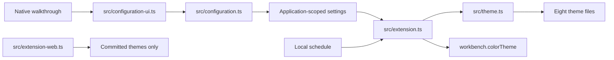

# Architecture

Start at `src/theme.ts`: it is the single theme compiler. The product ships eight (8) theme files —
six fixed Soft/Medium/Hard presets and two configurable Light/Dark themes.



## One path per capability

| Capability             | Owner                           | Output                                            |
| ---------------------- | ------------------------------- | ------------------------------------------------- |
| Palette                | `src/palette/index.ts`          | Everforest colors                                 |
| Theme compilation      | `src/theme.ts`                  | Complete preset/configurable data                 |
| Configuration model    | `src/configuration.ts`          | Staged native setting updates                     |
| Native controls        | `src/configuration-ui.ts`       | Guided, advanced, and automatic choices           |
| Desktop preferences    | `src/extension.ts`              | Regenerated installed JSON                        |
| Theme regeneration     | `src/theme-regeneration.ts`     | Synchronization and feedback for generated themes |
| Theme-file lock        | `src/theme-file-lock.ts`        | Serializes generated-theme file writes            |
| Theme-file transaction | `src/theme-file-transaction.ts` | Atomic replacement and recovery                   |
| Scheduled switching    | `src/schedule.ts`               | Active theme and next boundary                    |
| Build generation       | `src/generate-themes.ts`        | Eight committed theme files                       |
| Browser fallback       | `src/extension-web.ts`          | Desktop capability guidance                       |

## Decisions

1. Keep the six named presets so existing `workbench.colorTheme` values never break. Add
   **Everforest Complete Dark** and **Everforest Complete Light** as configurable themes.
2. Compile build-time and runtime themes through `src/theme.ts`. A setting cannot drift from shipped
   defaults.
3. Regenerate only the two configurable installed theme files. Presets stay fixed. Runtime code
   reads VS Code configuration and its own installed theme files; it may inspect workspace/folder
   configuration values to guard global-only writes; it writes global extension/native theme
   settings and those two extension-owned files. Theme replacement can briefly create
   extension-owned lock, journal, temporary, backup, and restore siblings beside them; these are
   transaction artifacts, not workspace files, and successful runs clean them up. It never reads
   workspace files or source code, sends telemetry, or makes network requests.
4. Scope all 14 extension settings to the application. Workspace settings cannot race over shared
   installed theme files.
5. Schedule one timer for the next boundary. Do not poll every minute. Native operating-system
   switching remains the recommended alternative when system appearance is preferred. A nonexistent
   spring-forward wall time is skipped; a repeated fall-back wall time uses its earlier occurrence.
6. Browser-hosted VS Code receives all eight committed themes. Its configuration commands explain
   the Desktop requirement and can open the native theme picker; file regeneration, scheduling, and
   the Desktop walkthrough require VS Code Desktop.
7. Primary setup has three required choices. Guided setup collects choices before persisting;
   Advanced Controls stage values until Apply. Both persist only after completion, roll back an
   incomplete write, run one configurable-theme regeneration check, and offer at most one reload
   when those files change. Automatic Light/Dark is separate: it persists switching mode/schedule
   and coordinates native appearance settings without regenerating theme files. Escape writes
   nothing.
8. `package.json` groups the same persisted settings for transparency, but supported workflows never
   require manual JSON.

## Theme coverage

`src/workbench/documented-workbench-colors.json` pins all 910 documented VS Code workbench color
keys at a recorded VS Code source commit. Handwritten mappings add 27 extension-contributed color
keys; generated themes therefore contain 937 mapped keys. Handwritten mappings override
deterministic fallbacks.

Refresh the contract:

```sh
node scripts/update-documented-workbench-colors.mjs <theme-color.md> <source-commit>
npm run generate
```

## Validation layers

1. Unit tests: palettes, all contrast combinations, premium settings, schedules, and accessibility.
2. Static validation: generated files, 937 workbench/extension color keys, and formatting.
3. Package validation: exact VSIX allowlist and release checksum contract.
4. Extension Host: install an exact VSIX, activate the runtime, regenerate a configurable theme,
   switch Light/Dark, and validate every installed theme against VS Code's color-theme schema.
5. Local gate: `.actrc` runs the pinned `.act/workflows/verify.yml` inside a digest-pinned Linux
   container with `--rm`, a bind-mounted repository, an anonymous `/github/workspace/node_modules`
   volume, and the named `everforest-codeql-cache` volume; the host runs native macOS checks. The
   anonymous dependency volume is removed with the ACT container; the named cache persists.
6. Release: build one versioned VSIX and checksum, preserve it as `validated-vsix`, test those exact
   bytes on Linux, macOS, Windows, and VS Code 1.95.3, then create the GitHub Release and publish
   the same artifact to the Marketplace.
7. Recovery: validate the failed Release run, its version tag, and its unexpired `validated-vsix`
   artifact; test those exact bytes across the same matrix, then create a missing GitHub Release
   only after package and Extension Host checks pass. Verify an existing release's exact state and
   bytes without mutation; never repair or clobber one.
8. Marketplace recovery: dispatch the separate protected workflow. It verifies an already-published
   GitHub Release, publishes those exact bytes, then verifies the package endpoint and live catalog;
   completion requires a successful run and live readback.

GitHub Releases are authoritative for published release notes and versioned artifacts. Marketplace
publishing is downstream of the verified GitHub Release asset.

## Primary references

- [Color theme extension guide](https://code.visualstudio.com/api/extension-guides/color-theme)
- [Theme contributions](https://code.visualstudio.com/api/references/contribution-points#contributes.themes)
- [Extension testing](https://code.visualstudio.com/api/working-with-extensions/testing-extension)
- [Web extensions](https://code.visualstudio.com/api/extension-guides/web-extensions)
- [Remote extensions](https://code.visualstudio.com/api/advanced-topics/remote-extensions)

The editable icon source is `media/icon.svg`. The tested and shipped Marketplace raster is
`media/icon.png` at 512px; the SVG remains the source for raster updates and is intentionally not a
packaged duplicate.
