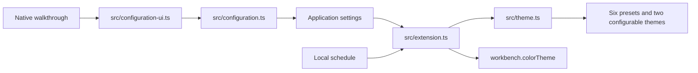

# Architecture

Start at `src/theme.ts`. It is the single theme compiler.



## One path per capability

| Capability          | Owner                     | Output                            |
| ------------------- | ------------------------- | --------------------------------- |
| Palette             | `src/palette/index.ts`    | Everforest colors                 |
| Theme compilation   | `src/theme.ts`            | Complete preset/configurable data |
| Configuration model | `src/configuration.ts`    | Staged native setting updates     |
| Native controls     | `src/configuration-ui.ts` | Guided and advanced choices       |
| Desktop preferences | `src/extension.ts`        | Regenerated installed JSON        |
| Scheduled switching | `src/schedule.ts`         | Active theme and next boundary    |
| Build generation    | `src/generate-themes.ts`  | Eight committed theme files       |

## Decisions

1. Keep the six named presets so existing `workbench.colorTheme` values never break. Add
   **Everforest Complete Dark** and **Everforest Complete Light** as configurable themes.
2. Compile build-time and runtime themes through `src/theme.ts`. A setting cannot drift from the
   shipped defaults.
3. Regenerate only the two configurable installed theme files. Presets stay fixed. Runtime code
   never reads workspaces, source files, telemetry, or the network.
4. Scope premium settings to the application. Workspace settings cannot race over shared installed
   theme files.
5. Schedule one timer for the next boundary. Do not poll every minute. Native operating-system
   switching remains the recommended alternative.
6. Browser-hosted VS Code receives all committed themes. File regeneration and scheduling require VS
   Code Desktop.
7. Primary setup has three required choices. Commands stage all values, persist only after
   completion, roll back an incomplete write, regenerate once, and offer at most one reload. Escape
   writes nothing.
8. `package.json` groups the same persisted settings for transparency, but supported workflows never
   require manual JSON.

## Theme coverage

`src/workbench/documented-workbench-colors.json` pins every documented VS Code workbench color at a
recorded VS Code source commit. Handwritten mappings override deterministic fallbacks.

Refresh the contract:

```sh
node scripts/update-documented-workbench-colors.mjs <theme-color.md> <source-commit>
npm run generate
```

## Validation layers

1. Unit tests: palettes, all contrast combinations, premium settings, schedules, and accessibility.
2. Static validation: generated files, schemas, 937 workbench colors, and formatting.
3. Package validation: exact VSIX allowlist.
4. Extension Host: install exact VSIX, activate runtime, regenerate a theme, and switch Light/Dark.
5. Local gate: reusable digest-pinned ACT Linux container, native macOS, CodeQL, Gitleaks, audits,
   release policy, and one external **Local validation** commit status.
6. Manual release: exact current `main` SHA, one versioned VSIX across Linux, macOS, Windows, and VS
   Code 1.95.3, CodeQL SARIF upload, release checksum, and Marketplace promotion through the
   protected `VSCE_PAT` secret.

## Primary references

- [Color theme extension guide](https://code.visualstudio.com/api/extension-guides/color-theme)
- [Theme contributions](https://code.visualstudio.com/api/references/contribution-points#contributes.themes)
- [Extension testing](https://code.visualstudio.com/api/working-with-extensions/testing-extension)
- [Web extensions](https://code.visualstudio.com/api/extension-guides/web-extensions)
- [Remote extensions](https://code.visualstudio.com/api/advanced-topics/remote-extensions)
